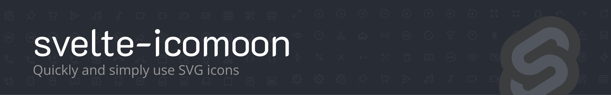

[](https://www.npmjs.com/package/svelte-icomoon)
[](https://opensource.org/licenses/MIT)

It makes it very simple to use SVG icons in your `Svelte` projects.

## Install

```
npm install svelte-icomoon
```

```
yarn add svelte-icomoon
```

## Usage

You can use the icons you selected on [IcoMoon](https://icomoon.io/app/) by downloading the `selection.json` file.

> You can try [svgps.app](https://svgps.app/) to generate `selection.json` file. 🎉

### Declare

```html
// Icon.svelte
<script>
  import Icomoon from "svelte-icomoon";

  import iconSet from "./selection.json";

  export let name;
  export let title;
  export let color;
  export let size = 16;
  export let disableFill = false;
  export let removeInitialStyle = false;
  export const style = {};
  const props = { name, title, color, size, disableFill, removeInitialStyle };
</script>

<Icomoon {...props} iconSet="{iconSet}" />
```

### Use

```html
<script>
  import Icon from "./Icon.svelte";
</script>

<Icon name="pencil" size="{30}" color="blue" />
```

## Props List

| Name              | Type          | Default | Sample                        |
| ----------------- | ------------- | ------- | ----------------------------- |
| iconSet           | Object        | -       | "selection.json file content" |
| name              | String        | -       | "home"                        |
| size              | Number,String | -       | "1em", 10, "100px"            |
| color             | String        | -       | "red", "#f00", "rgb(0,0,0)"   |
| style             | Object        | {...}   | { color: '#ff0'}              |
| title             | String        | -       | "Icon Title"                  |
| disableFill       | Boolean       | -       | true                          |
| removeInlineStyle | Boolean       | -       | true                          |

### Default Style

```js
{
  display: "inline-block",
  stroke: "currentColor",
  fill: "currentColor",
}
```

### Related Links

- [svgps.app](https://svgps.app)
- [react-icomoon](https://github.com/aykutkardas/react-icomoon)
- [vue-icomoon](https://github.com/aykutkardas/vue-icomoon)
